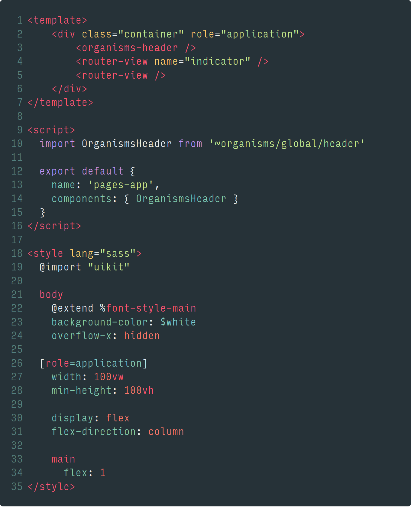

name: cover
class: middle

# Atomic Design & Vue.js

L'atomic design dans une architecture orientée composants

![:ref]

---
class: tiles center middle

# Kézako ?

-  Vue.js
-  Atomic Design
- .kss[KSS] Knyle Style Guide

---
layout: false
class: section bottom
background-image: url(../img/placeholders/sea-nature-art-animals.jpg)

# Atomic Design

---
layout: true

.breadcrumb[Atomic Design]

---
class: middle

# Atomic ?

.large[
- Une structure modulaire
- Une architecture orientée composant
- Une méthodologie de design
]

---
class: middle

# Comment ça fonctionne ?

1. L'_atome_ <small>Un bouton, un logo, un titre…</small>
2. La _molécule_ <small>Une en-tête, un bandeau, un champ de formulaire…</small>
3. L'_organisme_ <small>Un formulaire, une navigation, une card, un footer…</small>
4. Le _template_ <small>Une structure complète, un blueprint de contenu</small>
5. La _page_ <small>Une instance spécifique de template</small>

→ Vous les appelez comme vous voulez <small>(je ne suis pas votre mère)</small>

- [Atomic Design | Brad Frost](http://bradfrost.com/blog/post/atomic-web-design/)
- [Atomic Design book](http://atomicdesign.bradfrost.com/)

---
class: inverse middle

# Et concrètement ?

<video autoplay="" loop="" width="100%">
  <source src="atomic-design.mp4">
</video>

---
class: middle
name: patternlab

# PatternLab.io

- Basé sur Node.js
- Permet d'organiser une librairie de composant
- Génère / Exporte un build des composants
- Utilise des jeux de données pour hydrater les templates
- Simule les états / variantes

> Pattern Lab helps you and your team build thoughtful, pattern-driven user interfaces using atomic design principles.

http://demo.patternlab.io/

---
layout: false
class: section
background-image: url(../img/placeholders/macro-photography-of-black-ant-beside-water-dew.jpg)

# Vue.js

---
layout: true

.breadcrumb[Vue.js]

---
class: code

# Les composants

---
class: code middle

# Choisissez bien votre langage de templating

---
class: code middle

# CSS… scoped?

---
layout: false
class: section bottom
background-image: url(../img/placeholders/primate-ape-thinking-mimic.jpg)

# Mix'em all!

---
layout: true

.breadcrumb[Mix'em all!]

---
class: code vertical middle center

# Organisation

---
class: code vertical middle center

# ~components/pages/app.vue

---
class: middle

# Objectif : Extraire les templates

.large[
1. Utiliser des templates externes
2. Lire les templates depuis les _single-file components_
3. ~~Copier / coller les templates~~
]

---
class: inverse code middle

# Importer dans PatternLab

---
class: single middle center

# **Boom!**

---
layout: false
class: section middle
background-image: url(../img/placeholders/egg-hammer-threaten-violence.jpg)

# On continue ?

---
layout: true

.breadcrumb[On continue ?]

---
class: middle

# KSS

.large[
- _Moteur de style guide_
- Utilise une convention dans les commentaires CSS
- Importe les markups depuis des templates
- Supporte les états / variations <small>(lui aussi)</small>
- Génère une doc statique
]

---
class: code middle

# Démo : les variables

---
class: code middle

# Démo : Les molécules

---
class: code middle

# Démo : les organismes

---
class: middle

# Isoler les styles

.large[
1. Contruire une bibliothèque réutilisable
2. Exposer des jeux de règles (pas des classes)
3. Faire de la composition
4. Utiliser les pré-processeurs CSS
]

---
class: code middle

---
class: code middle

---
class: middle

# KSS + Vue.js ?

.large[
- Import des styles de la bibliothèque
- Export de la doc via KSS
- Utiliser des méthodologies de nommage comme BEM
]

https://tzi.fr/slides/riviera2018-bem/

---
class: single middle center

---
layout: false
class: section bottom
background-image: url(../img/placeholders/portrait-bird-nature-wild.jpg)

# Cool ! Comment je le mets en place ?

---
layout: true

.breadcrumb[Cool ! Comment je le mets en place ?]

---
class: inverse middle center

# Pour le moment, à la main

---
class: inverse single middle

# **Bientôt, avec des mécaniques d'exports depuis les single-file components**

---
name: speaker
class: center middle single

# m4dz

**Paranoïd Web Dino & Tech Evangelist**

.extras[
[m4dz.net](https://m4dz.net) | [@m4d_z](https://twitter.com/m4d_z) | PGP [0xD4627C417D969710](https://m4dz.net/0xD4627C417D969710.asc)
]

.org[
## 

.extras[
  [www.alwaysdata.com](https://www.alwaysdata.com)
]
]

---
layout: false
class: section, bottom
background-image: url('../img/placeholders/collaborate.jpg')

# Questions ?

---
name: thanks

# Merci !

## Fontes

- Titrage : [Sinzano](http://typodermicfonts.com/sinzano/) by Typodermic http://typodermicfonts.com - [Fontspring webfont EULA](https://www.fontspring.com/licenses_text/lv4e5lv2k2)
- Intertitres & labeur : [Source Sans Pro](https://github.com/adobe-fonts/source-sans-pro) by Adobe https://github.com/adobe-fonts - [Open Font Licence](https://raw.githubusercontent.com/adobe-fonts/source-sans-pro/master/LICENSE.txt)
- Monospace : [Source Code Pro](https://github.com/adobe-fonts/source-code-pro) by Adobe https://github.com/adobe-fonts - [Open Font Licence](https://raw.githubusercontent.com/adobe-fonts/source-code-pro/master/LICENSE.txt)

## Outils

- Moteur de présentation : [Remark](https://github.com/gnab/remark)

.licence.round[

![:ref]

disponible sous licence [CC BY-SA 4.0](http://creativecommons.org/licenses/by-sa/4.0/)
]