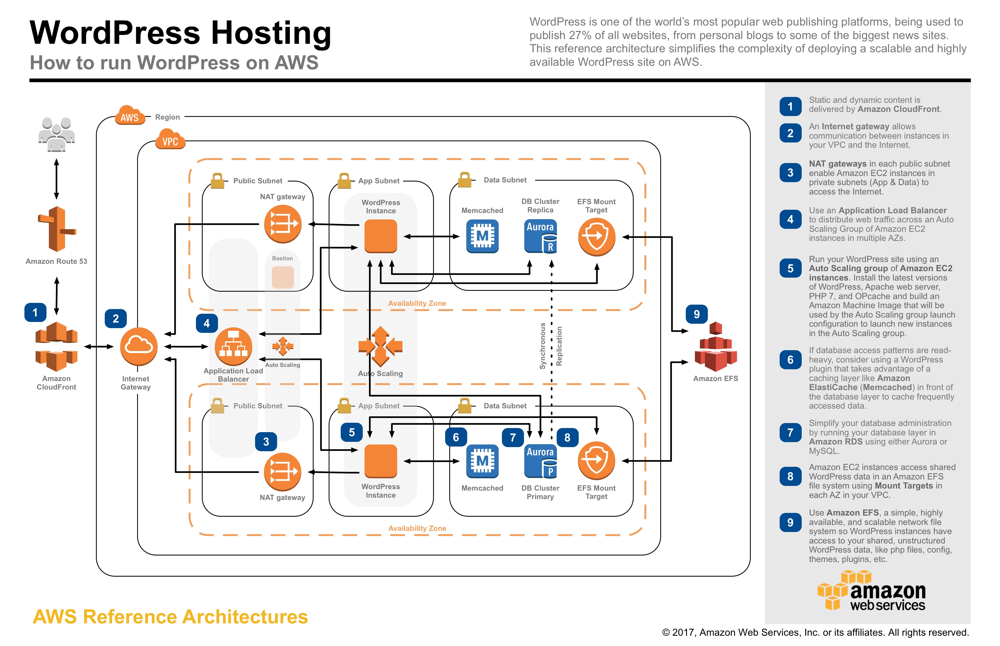

name: cover
class: middle

# Ground control to the Moon

Choose your hosting provider the right way

![:ref]

---
layout: false
class: logos middle center inverse

# Hosting: We're in orbit

https://www.cyberspace.builders/

---
class: middle

# State of hosting in 2018

<blockquote class="twitter-tweet" data-lang="fr">
$ whoami ubuntu  $ whereami  In a Docker container. Inside a Kubernetes cluster. Running in a VM. On top of a Hypervisor. In someone else&#39;s datacenter.   $ howdidigethere No. Fucking. Clue.
&mdash; Bruno Borges (@brunoborges) <a href="https://twitter.com/brunoborges/status/1003119599133470720?ref_src=twsrc%5Etfw">3 juin 2018</a></blockquote>

---
layout: false
class: single bottom right inverse
background-image: url(control-center.jpg)

# **It may not be difficult, isn't it?**

---
layout: false
class: inverse single center bottom
background-image: url(moon.jpg)

# **Time to go the Moon (again)**

---
layout: false
class: section bottom
background-image: url(../img/placeholders/ball-shaped-beach-blur-close-up.jpg)

# What is a Web Hosting Provider?

---
layout: true

.breadcrumb[What is a Web Hosting Provider?]

---
class: inverse tiles logos middle

# IaaS, PaaS, SaaS

-  Infrastructure-as-a-Service
-  Platform-as-a-Service
-  Software-as-a-Service

---
class: middle

# Infrastructure as a Service

.large[
- Bare metal machine or VM machine
- You choose the OS
- You're alone on it
]

---
class: middle

# Platform as a Service

.large[
- Everything embed
- You push, it works
- We choose, you run
]

---
class: middle

# Software as a Service

.large[
- You never access the server
- You stay focus on the solution
- You're just a customer
]

---
class: single middle

# Containers

.large[
Containers are sandboxed environment where you can arbitrary execute code, which can be an entire OS or just a subset of user-space dedicated for execution
]

---
class: single middle

# Cloud

.large[
Cloud is a cluster of containers ready to run your code, without the knowledge of how the infrastructure works
]

---
class: center middle

# Cloud is just computers

---
class: middle

# Function as a Service (FaaS)

.large[
- You don't have to think about backend
- You run code with dedicated APIs
- Servers are not required
]

---
class: middle center

# Serverless

---
layout: false
class: section
background-image: url(../img/placeholders/strength-strong-toy-action-figure.jpg)

# Who are you?

---
layout: true

.breadcrumb[Who are you?]

---
class: middle single

# Freelance

.large[
You run your own business, you've got clients for whom you develop apps and you host their services
]

---
class: middle single

# SME

.large[
You run your own website to present/sell you services/solutions/products
]

---
class: middle single

# Startup

.large[
You offer your solution as a SaaS for hundreds of customers
]

---
class: middle single

# Big Corp™

.large[
You have a dense trafic of hundreds of thousands connections per day on your webservice
]

---
class: middle center single inverse

# **What are your needs?**

---
class: middle

# Freelance

.large[
- Strong hoster
- Multi-accounts
- Easy deploy
- Easy account management
- Built-in solution
]

---
class: middle

# SME

.large[
- Comprehensible offer
- Good support
- Tailored solution
]

---
class: middle

# Startup

.large[
- Controlled costs
- Easy to evolve
- Braindead to use
- Not too huge
]

---
class: middle

# Big Corp™

.large[
- Clusters
- Control on machines
- Strong protection
- Resilience
]

---
layout: false
class: section bottom
background-image: url(../img/placeholders/flowers-teddy-bear-toy.jpeg)

# What is important?

---
layout: true

.breadcrumb[What is important?]

---
class: center middle

# Hmm… It Depends

---
class: middle

# Hosting Plan & Features

- SSL
- Remote access
- Power ((v)CPUs, Ram, Storage…)
- Supported features (languages, DBs, Brokers, HTTP/2, etc)
- Monitoring
- Support
- Billing slices

---
class: middle center

# Ranking / e-reputation

---
class: middle

# Attacks resilience / Black-listing

.large[
- Listed anywhere?
- DDoS protection?
- Reported in any leak before?
- Uptime?
]

---
class: middle tiles

# Limits

- <svg><use xlink:href="../img/icons/fontawesome/fa-solid.svg#battery-three-quarters"/></svg> Power
- <svg><use xlink:href="../img/icons/fontawesome/fa-solid.svg#wifi"/></svg> Bandwitdh
- <svg><use xlink:href="../img/icons/fontawesome/fa-solid.svg#hdd"/></svg> Storage

---
class: middle center

# Backups

---
class: middle inverse single

# It's better to think about your needs

---
class: middle

# A marketing special-event website

.large[
- Absorbs a huge trafic in a unpredictable time window
- Distribute across many instances
- Quickly close the service after
]

--
.large[
**→ A cloud hoster w/ high-scalability**
]

---
class: middle

# A startup SaaS

.large[
- An easy to deploy environment
- A pre-provisionned instances
- A quick-to-evolve solution
]

--
.large[
**→ A managed PaaS hosting**
]

---
class: middle

# Little serverless website

.large[
- FaaS
- Simple hosting
]

--
.large[
**→ Cloud hosting**
]

---
layout: false
class: section bottom
background-image: url(../img/placeholders//keys-unlock.jpg)

# How to choose well?

---
layout: true

.breadcrumb[How to choose well?]

---
class: single middle center

# Free Trial

---
class: single middle center

# Simplicity

---
class: middle center single

.large[

]

---
class: middle single

# Options

.large[
- What features are mandatory?
- How can you grow-up?
- Which costs are hidden?
]

---
class: single middle center

# Support

---
class: single middle center

# Resilience

---
class: single middle center

# Reputation

---
class: middle center single inverse

# **Don't be blinded**

---
class: middle

# Costs

.large[
- Highest competitors are nearly same-priced
- Low-level IaaS can be cheaper **in money**
- All PaaS are not identicals
]

---
class: middle center single inverse

# PaaS vs PaaS

---
class: middle center single

# ~~PaaS vs PaaS~~
# New-school vs Old-school

---
class: middle center

# Scaling

---
class: middle center

# Who will fix the mess?

---
class: middle center single inverse

# There's more important

---
class: middle center

# Localization

---
class: single middle center

# APIs

---
class: tiles middle

# Resources

- <svg><use xlink:href="../img/icons/fontawesome/fa-solid.svg#building"/></svg> Shared
- <svg><use xlink:href="../img/icons/fontawesome/fa-solid.svg#home"/></svg> Dedicated
- <svg><use xlink:href="../img/icons/fontawesome/fa-solid.svg#warehouse"/></svg> Cloud

---
class: middle

# A word about performance

.large[
- Bandwith
- Load time
- Cache
- Requests handling
- Latency
]

---
layout: false
class: section bottom
background-image: url(../img/placeholders/portrait-bird-nature-wild.jpg)

# Now I'm sure I'm picking the right provider!

---
layout: true

.breadcrumb[Now I'm sure I'm picking the right provider!]

---
class: single middle center

# **No, you don't.**

---
class: middle single

# Hosting costs ressources: money, labor time, support…

.large[
Where will you put your energy on?
]

---
class: middle single

# Independance and portability are mandatory

.large[
Don't be stucked to a hosting provider, you're free!
]

---
class: single middle center

# **No, you don't.**

---
class: middle

# But you can seek for:

.large[
- Confidence
]

--
.large[
- (Tech) Support
]

--
.large[
- Reliability
]

--
.large[
- Simplicity
]

--
.large[
- Efficiency
]

---
layout: false
name: speaker
class: center middle single

# m4dz

**Paranoïd Web Dino & Tech Evangelist**

.extras[
[m4dz.net](https://m4dz.net) | [@m4d_z](https://twitter.com/m4d_z) | PGP [0xD4627C417D969710](https://m4dz.net/0xD4627C417D969710.asc)
]

.org[
## 

.extras[
  [www.alwaysdata.com](https://www.alwaysdata.com)
]
]

---
layout: false
class: section, bottom
background-image: url('../img/placeholders/collaborate.jpg')

# Questions ?

---
name: thanks

# Thanks!

## Fonts

- Titles: [Sinzano](http://typodermicfonts.com/sinzano/) by Typodermic http://typodermicfonts.com - [Fontspring webfont EULA](https://www.fontspring.com/licenses_text/lv4e5lv2k2)
- Intertitles and labor: [Source Sans Pro](https://github.com/adobe-fonts/source-sans-pro) by Adobe https://github.com/adobe-fonts - [Open Font Licence](https://raw.githubusercontent.com/adobe-fonts/source-sans-pro/master/LICENSE.txt)
- Monospace: [Source Code Pro](https://github.com/adobe-fonts/source-code-pro) by Adobe https://github.com/adobe-fonts - [Open Font Licence](https://raw.githubusercontent.com/adobe-fonts/source-code-pro/master/LICENSE.txt)

## Tools

- Slides engine: [Remark](https://github.com/gnab/remark)

.licence.round[

![:ref]

available under [CC BY-SA 4.0](http://creativecommons.org/licenses/by-sa/4.0/)
]
