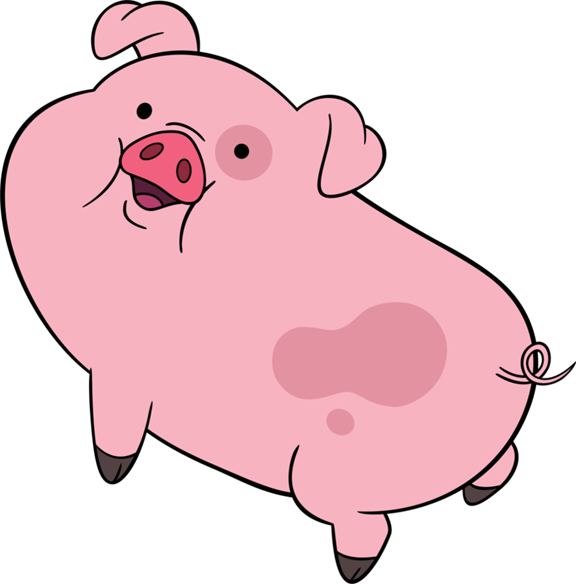
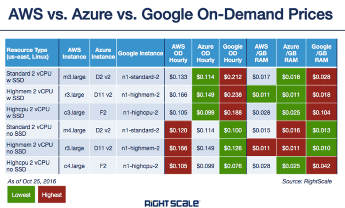
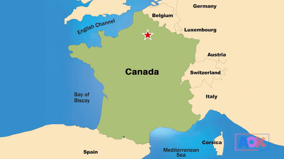

name: cover
class: middle

# Ground control to the Moon

Choose your hosting provider the right way

![:ref]

---
layout: false
class: logos middle center inverse

# We're in orbit

https://www.cyberspace.builders/

---
class: middle

# State of hosting in 2018

<blockquote class="twitter-tweet" data-lang="fr">
$ whoami ubuntu  $ whereami  In a Docker container. Inside a Kubernetes cluster. Running in a VM. On top of a Hypervisor. In someone else&#39;s datacenter.   $ howdidigethere No. Fucking. Clue.
&mdash; Bruno Borges (@brunoborges) <a href="https://twitter.com/brunoborges/status/1003119599133470720?ref_src=twsrc%5Etfw">3 juin 2018</a></blockquote>

---
layout: false
class:
background-image: url(control-center.jpg)

---
layout: false
class: inverse single center bottom
background-image: url(moon.jpg)

# **Time go go the Moon (again)**

---
layout: false
class: section bottom
background-image: url(../img/placeholders/ball-shaped-beach-blur-close-up.jpg)

# What is a Web Hosting Provider?

---
layout: true

.breadcrumb[What is a Web Hosting Provider?]

---
class: inverse tiles logos middle

# IaaS, PaaS, SaaS

-  Infrastructure-as-a-Service
-  Platform-as-a-Service
-  Software-as-a-Service

---
class: single middle center

# **Cloud?**

---
class: single middle center

# **Containers?**

---
class: center middle

# Cloud is just computers!

---
name: speaker
class: center middle single

# m4dz

**Paranoïd Web Dino & Tech Evangelist**

.extras[
[m4dz.net](https://m4dz.net) | [@m4d_z](https://twitter.com/m4d_z) | PGP [0xD4627C417D969710](https://m4dz.net/0xD4627C417D969710.asc)
]

.org[
## 

.extras[
  [www.alwaysdata.com](https://www.alwaysdata.com)
]
]

---
layout: false
class: section bottom
background-image: url(../img/placeholders/flowers-teddy-bear-toy.jpeg)

# What is important?

---
layout: true

.breadcrumb[What is important?]

---
class: middle

# Hosting Plan & Features

- SSL
- Remote access
- Power ((v)CPUs, Ram, Storage…)
- Supported features (languages, DBs, Brokers, HTTP/2, etc)
- Monitoring
- Support
- Billing slices

---
class: middle center

# Ranking / e-reputation

---
class: middle

# Attacks resilience / Black-listing

.large[
- Listed anywhere?
- DDoS protection?
- Reported in any leak before?
- Uptime?
]

---
class: middle tiles

# Limits?

- <svg><use xlink:href="../img/icons/fontawesome/fa-solid.svg#battery-three-quarters"/></svg> Power
- <svg><use xlink:href="../img/icons/fontawesome/fa-solid.svg#wifi"/></svg> Bandwitdh
- <svg><use xlink:href="../img/icons/fontawesome/fa-solid.svg#hdd"/></svg> Storage

---
class: middle center

# Backups!

---
layout: false
class: section bottom
background-image: url(../img/placeholders//keys-unlock.jpg)

# How to choose well?

---
layout: true

.breadcrumb[How to choose well?]

---
class: single middle center

# Free Trial

---
class: single middle center

# Simplicity

---
class: single middle center

# Options

---
class: single middle center

# Support

---
class: single middle center

# Uptime

---
class: single middle center

# Reputation

---
layout: false
class: section up
background-image: url(../img/placeholders/man-on-bench.jpeg)

# What doesn't matter?

---
layout: true

.breadcrumb[What doesn't matter?]

---
class: middle

# Cost

.large[

]

---
class: middle center

# Scaling

---
layout: false
class: section bottom
background-image: url(../img/placeholders/nostalgy-collector-michelle-heavy-metal.jpg)

# What could have an impact?

---
layout: true

.breadcrumb[What could have an impact?]

---
class: middle center

# Localization

---
class: single middle center

# APIs

---
class: tiles middle

# Resources

- <svg><use xlink:href="../img/icons/fontawesome/fa-solid.svg#building"/></svg> Shared
- <svg><use xlink:href="../img/icons/fontawesome/fa-solid.svg#home"/></svg> Dedicated
- <svg><use xlink:href="../img/icons/fontawesome/fa-solid.svg#warehouse"/></svg> Cloud

---
class: middle

# A word about performance

.large[
- Bandwith
- Load time
- Cache
- Requests handling
- Latency
]

---
layout: false
class: section bottom
background-image: url(../img/placeholders/portrait-bird-nature-wild.jpg)

# Now I'm sure I'm picking the right provider!

---
layout: true

.breadcrumb[Now I'm sure I'm picking the right provider!]

---
class: single middle center

# **No, you don't.**

---
class: middle

# But you can seek for:

.large[
- Confidence
]

--
.large[
- (Tech) Support
]

--
.large[
- Reliability
]

--
.large[
- Simplicity
]

--
.large[
- Efficiency
]

---
name: speaker
class: center middle single

# m4dz

**Paranoïd Web Dino & Tech Evangelist**

.extras[
[m4dz.net](https://m4dz.net) | [@m4d_z](https://twitter.com/m4d_z) | PGP [0xD4627C417D969710](https://m4dz.net/0xD4627C417D969710.asc)
]

---
layout: false
class: section, bottom
background-image: url('../img/placeholders/collaborate.jpg')

# Questions ?

---
name: thanks

# Thanks!

## Fonts

- Titles: [Sinzano](http://typodermicfonts.com/sinzano/) by Typodermic http://typodermicfonts.com - [Fontspring webfont EULA](https://www.fontspring.com/licenses_text/lv4e5lv2k2)
- Intertitles and labor: [Source Sans Pro](https://github.com/adobe-fonts/source-sans-pro) by Adobe https://github.com/adobe-fonts - [Open Font Licence](https://raw.githubusercontent.com/adobe-fonts/source-sans-pro/master/LICENSE.txt)
- Monospace: [Source Code Pro](https://github.com/adobe-fonts/source-code-pro) by Adobe https://github.com/adobe-fonts - [Open Font Licence](https://raw.githubusercontent.com/adobe-fonts/source-code-pro/master/LICENSE.txt)

## Tools

- Slides engine: [Remark](https://github.com/gnab/remark)

.licence.round[

![:ref]

available under [CC BY-SA 4.0](http://creativecommons.org/licenses/by-sa/4.0/)
]
