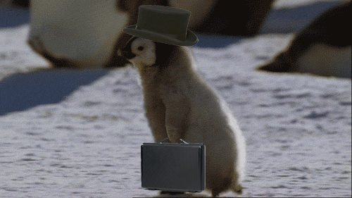
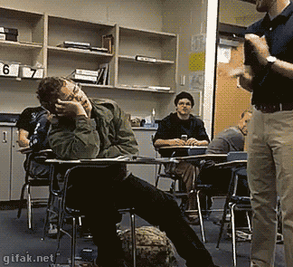

name: cover
class: middle

# Full-remote

Guide de survie en environnement distant

![:ref]

---
layout: false
class: section bottom
background-image: url(../img/placeholders/book-sunglasses-old-nostalgic.jpg)

# Point Lexical : qu'est-ce que le _remote_ ?

---
layout: true

.breadcrumb[Point Lexical : qu'est-ce que le _remote_ ?]

---
class: middle

# C'est quoi ?

.large[
* travailler à distance
* collaborer avec les gens
* _full-remote_ (mais pas que ça)
]

---
class: middle

# C'est pour qui ?

.large[
* GrosseBoite™ / StartupNation™
* Groupes
* Associations
* (H)acktivistes
* Communautés
]

---
class: middle

# Qui êtes-vous ?

.large[autrement dit : qui est concerné ?]

.large[
* vous qui avez envie de _remote_
* vous qui pensez qu'on ne peut pas travailler à distance
* vous qui imaginez que les rock-stars sont toutes au même endroit <small>(ou qu'elles vont déménager pour vous)</small>
]

---
class: middle center single inverse

# Passer au travail à distance

---
class: middle

# Des avantages…

.large[
* meilleur découpage de vos journées
* l'appui de la technologie
* fin du 9-17 (ou du 10-18)
* hors la ville
* meilleure qualité de vie
* plus écologique
]

---
class: middle

# … des inconvénients

.large[
* ce n'est pas magique
* discipline !
* attention à la procrastination
* distractions, différentes, mais présentes
]

---
class: middle single inverse

# Mythes et fantasmes

---
class: middle single

## «&nbsp;On ne peut bien travailler que tous ensemble au même endroit.&nbsp;»

---
class: middle single

## «&nbsp;Comment je peux être sûr que tu bosses&nbsp;?&nbsp;»

---
class: middle single

## «&nbsp;Pas de séries, du profit&nbsp;!&nbsp;»

---
class: middle single

## «&nbsp;On ne peut pas garantir la cybersécurité depuis ailleurs que le bureau.&nbsp;»

---
class: middle single

## «&nbsp;Le full-remote, oui, mais avec au moins un jour par semaine sur site.&nbsp;»

---
class: middle single

## «&nbsp;Tout le monde va l'exiger si je te l'accorde&nbsp;!&nbsp;»

---
class: middle single

## «&nbsp;Mais… et si j'ai besoin de toi&nbsp;?&nbsp;»

---
class: middle single

## «&nbsp;Ce n'est pas dans notre culture de toutes façons.&nbsp;»

---
class: middle single

## «&nbsp;Ça n'est pas applicable dans notre contexte d'activité.&nbsp;»

---
layout: false
class: section
background-image: url(../img/placeholders/close-up-of-clothes-hanging-in-store.jpeg)

# Organiser le travail à distance

---
layout: true

.breadcrumb[Organiser le travail à distance]

---
class: middle

# Construire une culture

.large[
* valeurs & manifeste(s)
* communs
* mentorat
* allez vers les autres
]

---
class: middle

# Accueillir

.large[
* mini-projet pour débuter
* transmettre les compétences
]

.center[

]

---
class: middle

# Une journée type

.large[
* établissez une routine
* coupez votre journée (local / remote)
* travaillez sur différents _devices_ / lieux
* composez-vous un environnement sonore
* gardez du temps perso !
]

---
class: stickit middle

.col[
# Do

.large[
* (pré-)occupez-vous des autres
* soyez accueillant
* ne vous contraignez pas
]
]

--

.col[
# Don't

.large[
* ne restez pas dans votre coin
* ne vous rythmez pas n'importe comment
]
]

---
layout: false
class: section bottom
background-image: url(../img/placeholders/nostalgy-collector-michelle-heavy-metal.jpg)

# Communiquer

---
layout: true

.breadcrumb[Communiquer]

---
class: middle

# Communiquer au quotidien

## dans une équipe entièrement distribuée

.large[
* tchats (IRC / XMPP / Mattermost / Slack…)
* en son (Mumble / WebRTC / Matrix…)
* en vidéo (Skype / WebRTC…)
* par email / listes de diffusions
]

---
class: middle center

# ou si on est seul à distance

---
class: middle single inverse

# Virtual Openspaces

.center[

]

---
class: middle

# Diffuser les savoirs

.large[
* bus-factor sur la communication
* partage de documents et bases documentaires
* newsletter interne
]

---
class: middle single inverse

# Restez focus

.large[→ coupez les notifications]

---
class: middle

# La machine à café

.large[
* une chatroom dédiée (Texte / Son)
* pas de pression
* pas de focus
* on y parle de tout *sauf* du boulot
]

---
class: middle single inverse

# La conversation délicate

.large[→ soyez disponible, c'est la base du savoir-être]

---
class: stickit middle

.col[
# Do

.large[
* soyez présents sur les chans
* partagez vos connaissances
* discutez aussi d'autre-chose
]
]

--

.col[
# Don't

.large[
* n'ignorez pas les problèmes
* "asynchrone" n'est pas "associal"
]
]

---
layout: false
class: section middle
background-image: url(../img/placeholders/one-ring-the-lord-of-the-rings-movie.jpg)

# Collaborer

---
layout: true

.breadcrumb[Collaborer]

---
class: middle

# Un bureau à distance

.large[
* espace de coworking
* home office (ergonomics)
* nomadisme
]

---
class: middle single inverse

# Le confort est essentiel et individuel

.large[→ faites-vous financer]

---
class: middle

# Savoir être efficace

.large[
* de la difficulté de se lever
* gérer son temps (pas de 7-21)
* pas de stress
]

---
class: middle single inverse

# On ne peut vous juger _que_ sur votre travail

.center[

]

---
class: middle center single

# Méthodologies et Agilité

---
class: middle single

## Time overlap

---
class: middle single

## Règle des 4h

---
class: middle single

## Horaires décalés

---
class: middle single

## Prévenir la dispersion

---
class: middle single

## Impliquez les gens

.large[(dans les réunions)]

---
class: middle single

## Daily Standup Meeting

---
class: middle single

## Rétros & Démos

---
class: middle single

## Planning pokers / Preview techniques

---
class: middle single

## Informez sur vos (in)disponibilités

---
class: middle single

## Tchats & Status

---
class: middle single

## Abusez des vidéos-conférences

---
class: middle single

## Code / Peer Reviews

---
class: middle single

## Peer Programming

---
class: middle

# Rencontrez les équipes

.large[
* Rencontres _régulières_
* Informelles
* Meetups & Hackathons
]

---
class: stickit middle

.col[
# Do

.large[
* travaillez où ça _vous_ convient
* comme ça _vous_ convient
* impliquez-vous, proposez
]
]

--
.col[
# Don't

.large[
* ne faites pas bande à part
]
]

---
layout: false
class: section bottom
background-image: url(../img/placeholders/bridge-wood-walk-passway.jpg)

# Revenir sur soi

---
layout: true

.breadcrumb[Revenir sur soi]

---
class: middle single inverse

# Garder confiance en soi

---
class: middle single

## Vous ne valez pas moins que les local-workers

.center[

]

---
class: middle single

## Utilisez des ice-breakers

---
class: middle single

## Check-ins one-on-one

---
class: middle single inverse

# Vaincre l'isolement

---
class: middle single

## S'ouvrir aux autres

---
class: middle single

## Ne pas s'enfermer volontairement (Cabin Fever)

.center[

]

---
class: middle single inverse

## Partez d'un principe de bienveillance

---
layout: false
class: section middle
background-image: url(../img/placeholders/peacock-animal-iridescent.jpg)

# Passer à l'échelle

---
layout: true

.breadcrumb[Passer à l'échelle]

---
class: middle

# Voir grossir l'équipe

.large[
* _all out in the open_
* auto-organisation sage & responsable
* évitez les micro-spots
* organisez les verres au bar
]

---
class: middle

# Travailler au travers du globe

.center[

.large[Décaler vos horaires de travail]
]

---
class: middle

# Travailler avec vos clients

.large[
* expliquez vos méthodologies
* fournissez des références
* soyez transparents
* soyez disponibles
]

---
class: middle single inverse

# Éviter le burn-out

---
class: middle

## Pas d'overwork

---
class: middle

## Vous n'êtes pas une perle rare

.large[(désolé, mais c'est tant mieux)]

---
class: middle

## Gardez du temps pour ce que vous aimez

.large[→ [Projet perso n°42 : une aventure ultrasonique](https://www.paris-web.fr/2017/conferences/projet-perso-n42-une-aventure-ultrasonique.php)]

---
class: middle

## Ne vous faites pas oublier

---
class: middle single inverse

# Les leçons du FOSS

---
class: middle

## Fournissez un travail intéressant

---
class: middle

## Facilitez l'accès à l'information

---
class: middle

## Rencontrez les gens pour les impliquer et vous impliquer

---
class: stickit middle

.col[
# Do

.large[
* partagez
* diffusez
* rencontrez
]
]

--

.col[
# Don't

.large[
* ne forcez jamais
* ne paniquez pas
]
]

---
layout: false
class: section bottom
background-image: url(../img/placeholders/portrait-bird-nature-wild.jpg)

# Êtes-vous prêt ?

---
layout: true

.breadcrumb[Êtes-vous prêt ?]

---
class: middle single

# Comment expérimenter&nbsp;?

---
class: middle single inverse

# Tout est __async__

---
name: speaker
class: center middle single

# m4dz

**Paranoïd Web Dino & Tech Evangelist**

.extras[
[m4dz.net](https://m4dz.net) | [@m4d_z](https://twitter.com/m4d_z) | PGP [0xD4627C417D969710](https://m4dz.net/0xD4627C417D969710.asc)
]

.org[
## 

.extras[
  [www.alwaysdata.com](https://www.alwaysdata.com)
]
]

---
layout: false
class: section, bottom
background-image: url('../img/placeholders/collaborate.jpg')

# Questions ?

---
name: thanks

# Merci !

## Fontes

- Titrage : [Sinzano](http://typodermicfonts.com/sinzano/) by Typodermic http://typodermicfonts.com - [Fontspring webfont EULA](https://www.fontspring.com/licenses_text/lv4e5lv2k2)
- Intertitres & labeur : [Source Sans Pro](https://github.com/adobe-fonts/source-sans-pro) by Adobe https://github.com/adobe-fonts - [Open Font Licence](https://raw.githubusercontent.com/adobe-fonts/source-sans-pro/master/LICENSE.txt)
- Monospace : [Source Code Pro](https://github.com/adobe-fonts/source-code-pro) by Adobe https://github.com/adobe-fonts - [Open Font Licence](https://raw.githubusercontent.com/adobe-fonts/source-code-pro/master/LICENSE.txt)

## Outils

- Moteur de présentation : [Remark](https://github.com/gnab/remark)

.licence.round[

![:ref]

disponible sous licence [CC BY-SA 4.0](http://creativecommons.org/licenses/by-sa/4.0/)
]
