name: cover
class: middle

# Git is a continuous manager

Comment utiliser Git pour automatiser votre production

![:ref]

---
layout: false
class: inverse single top right
background-image: url(factory.jpg)

# **La production continue est une usine**

---
layout: false
class: section bottom
background-image: url(../img/placeholders/egg-hammer-threaten-violence.jpg)

# Automatiser avec Git

---
layout: true

.breadcrumb[Automatiser avec Git]

---
class: middle

# Hooks & Bare

.large[
Use :

- Accès _SSH_ au serveur distant principal
- _Bare_ repository : `git init --bare project.git`
- _Deploy remote_ en local : `git remote add deploy ssh://me@end-server/project.git`
]

---
class: middle

# Hooks & Bare

.large[
Définissez :

- _Hooks_ dans le bare repository
- _Scripts_ pour automatiser les tâches
]

---
class: carbon

# Update & Post-receive

- _update_ automatise les actions sur chaque branche
- _post-receive_ automatise une action quand l'ensemble du dépôt est poussé

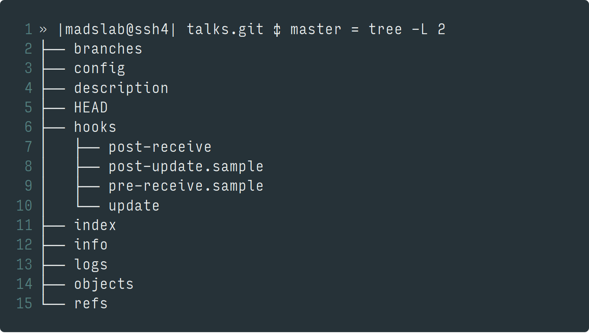

.center[`git push deploy` 👌]

---
class: carbon middle

# Scripts

Utilisez des _scripts externes_ pour isoler vos tâches :

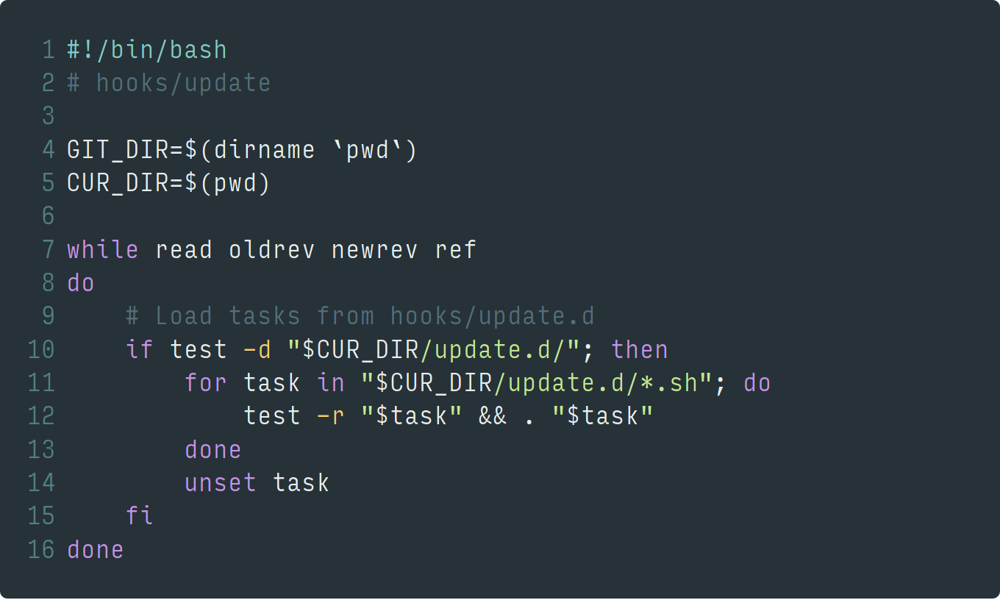

---
class: carbon middle

# Découper les tâches

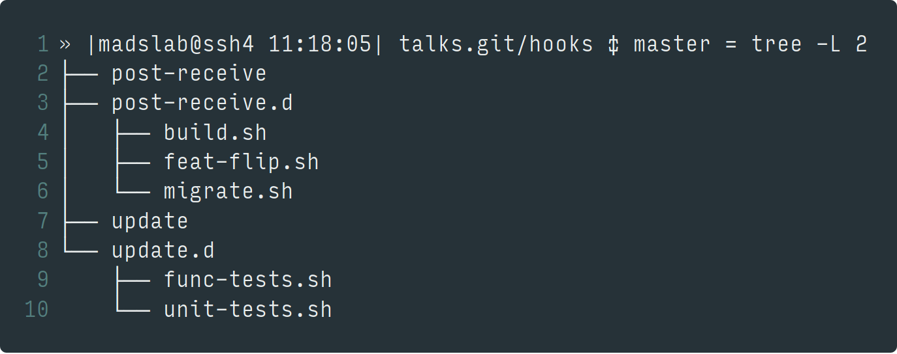

---
class: carbon middle

# Filtrer les appels

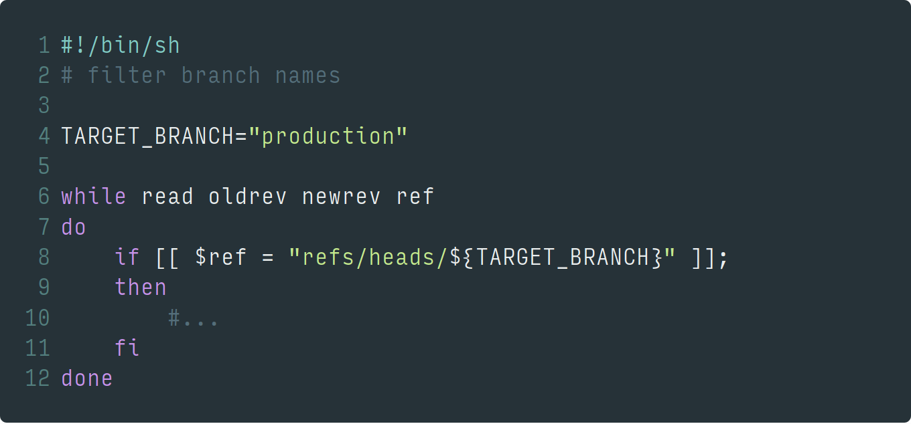

---
layout: false
class: section top
background-image: url(../img/placeholders//creative-desk-pens-school.jpg)

# Use-cases

---
layout: true

.breadcrumb[Use-cases]

---
class: carbon middle

# Unit testing <svg><use xlink:href="../img/icons/fontawesome/fa-solid.svg#wrench"></use></svg>

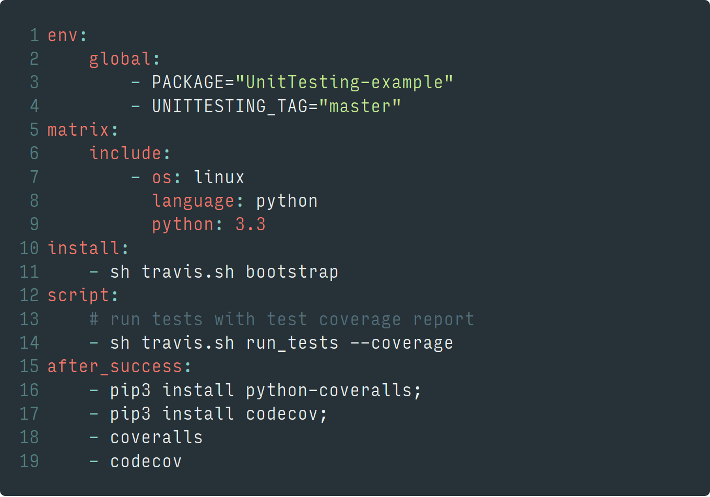

---
class: carbon middle

# Unit Testing <svg><use xlink:href="../img/icons/fontawesome/fa-solid.svg#code-branch"></use></svg>

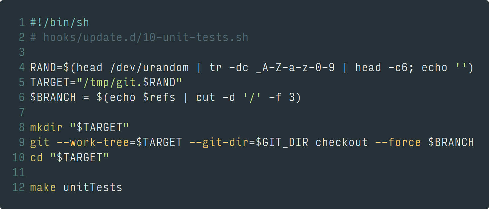

---
class: carbon middle

# Functional testing <svg><use xlink:href="../img/icons/fontawesome/fa-solid.svg#wrench"></use></svg>

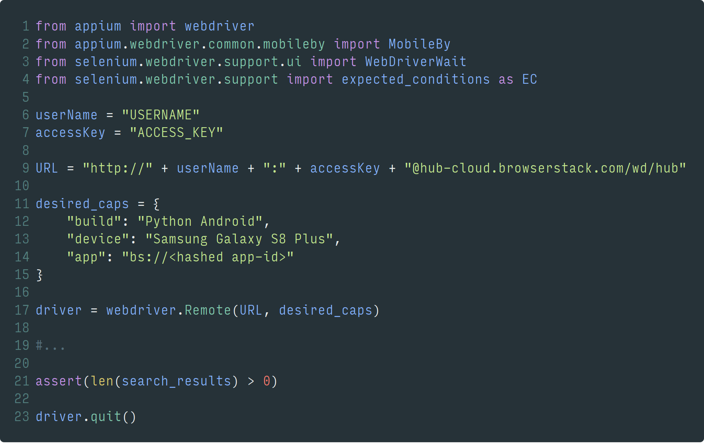

---
class: carbon middle

# Functonal testing <svg><use xlink:href="../img/icons/fontawesome/fa-solid.svg#code-branch"></use></svg>

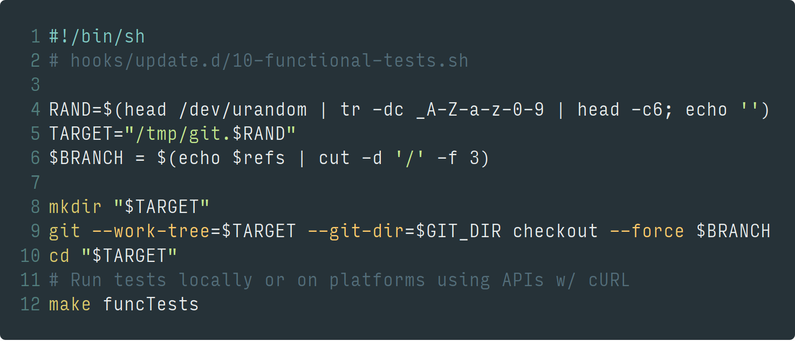

---
class: middle center

# Build <svg><use xlink:href="../img/icons/fontawesome/fa-solid.svg#wrench"></use></svg>

---
class: carbon middle

# Build (e.g. w/ Docker) <svg><use xlink:href="../img/icons/fontawesome/fa-solid.svg#code-branch"></use></svg>

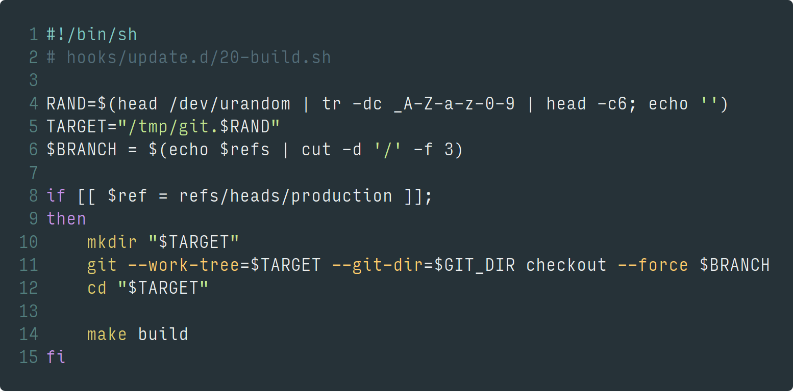

---
class: middle center

# Delivery <svg><use xlink:href="../img/icons/fontawesome/fa-solid.svg#wrench"></use></svg>

Userspace filesystem, SSH/SFTP, Rsync, etc.

---
class: carbon middle

# Delivery <svg><use xlink:href="../img/icons/fontawesome/fa-solid.svg#code-branch"></use></svg>

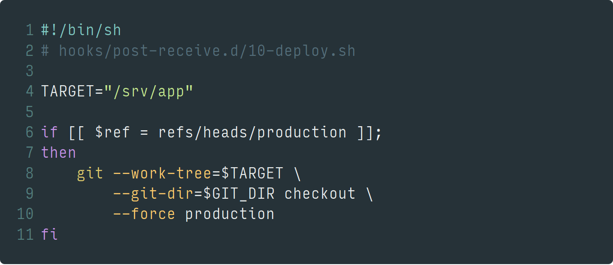

---
class: middle center

# Migrations <svg><use xlink:href="../img/icons/fontawesome/fa-solid.svg#wrench"></use></svg>

---
class: carbon middle

# Migrations <svg><use xlink:href="../img/icons/fontawesome/fa-solid.svg#code-branch"></use></svg>

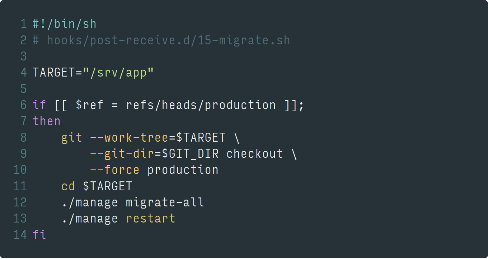

---
class: middle tiles

# Features-flipping <svg><use xlink:href="../img/icons/fontawesome/fa-solid.svg#wrench"></use></svg>

- <svg><use xlink:href="../img/icons/fontawesome/fa-solid.svg#toolbox"/></svg> Outils externes
- <svg><use xlink:href="../img/icons/fontawesome/fa-solid.svg#hand-pointer "/></svg> Interfaces complexes
- <svg><use xlink:href="../img/icons/fontawesome/fa-solid.svg#code"/></svg> Code spécifique

---
class: middle

# Features-flipping <svg><use xlink:href="../img/icons/fontawesome/fa-solid.svg#code-branch"></use></svg>

.large[
- Use INI files for _ACL_/_Perms_/_Flags_
- Rely on them in your libraries
- Push them on end-server
- Restart / Reload app using hook scripts
]

---
layout: false
class: inverse single top left
background-image: url(concrete.jpg)

# **Ok, mais c'est trop bas-niveau là**

---
layout: false
class: section bottom
background-image: url(../img/placeholders/flowers-teddy-bear-toy.jpeg)

# Faciliter la prise en main avec Django

---
layout: true

.breadcrumb[Faciliter la prise en main avec Django / Node.js]

---
class: single middle

# Offrir une API

.large[
  [Django REST Framework](http://www.django-rest-framework.org/)
]

---
class: tiles middle

# Manger des logs

- <svg><use xlink:href="../img/icons/fontawesome/fa-solid.svg#bug"/></svg> Common libs for logs
- <svg><use xlink:href="../img/icons/fontawesome/fa-solid.svg#blender"/></svg> Assemble
- <svg><use xlink:href="../img/icons/fontawesome/fa-solid.svg#share"/></svg> Exports

---
class: single middle

# Générer du feedback

.large[
  [Django Charts / FusionCharts](https://www.fusioncharts.com/django-charts/)
]

---
class: middle center

# Monitorer

---
class: middle

# Faire du reporting

.large[
- Use _git-multimail_ for emails alerts
- Send messages to _IRC_/_XMPP_/_Slack_/etc. APIs
- Expose _JSON_/_BSON_ _Streams_ for clients
]

---
class: middle center

# Analyser / Visualiser les sorties

---
class: center, middle, inverse, single

# **Scripts are powerful, Git is powerful enough**

# **use your imagination**

---
name: speaker
class: center middle single

# m4dz

**Paranoïd Web Dino & Tech Evangelist**

.extras[
[m4dz.net](https://m4dz.net) | [@m4d_z](https://twitter.com/m4d_z) | PGP [0xD4627C417D969710](https://m4dz.net/0xD4627C417D969710.asc)
]

.org[
## 

.extras[
  [www.alwaysdata.com](https://www.alwaysdata.com)
]
]

---
layout: false
class: section, bottom
background-image: url('../img/placeholders/collaborate.jpg')

# Questions ?

---
name: thanks

# Merci !

## Fonts

- Titles: [Sinzano](http://typodermicfonts.com/sinzano/) by Typodermic http://typodermicfonts.com - [Fontspring webfont EULA](https://www.fontspring.com/licenses_text/lv4e5lv2k2)
- Intertitles and labor: [Source Sans Pro](https://github.com/adobe-fonts/source-sans-pro) by Adobe https://github.com/adobe-fonts - [Open Font Licence](https://raw.githubusercontent.com/adobe-fonts/source-sans-pro/master/LICENSE.txt)
- Monospace: [Source Code Pro](https://github.com/adobe-fonts/source-code-pro) by Adobe https://github.com/adobe-fonts - [Open Font Licence](https://raw.githubusercontent.com/adobe-fonts/source-code-pro/master/LICENSE.txt)

## Tools

- Slides engine: [Remark](https://github.com/gnab/remark)

.licence.round[

![:ref]

available under [CC BY-SA 4.0](http://creativecommons.org/licenses/by-sa/4.0/)
]
