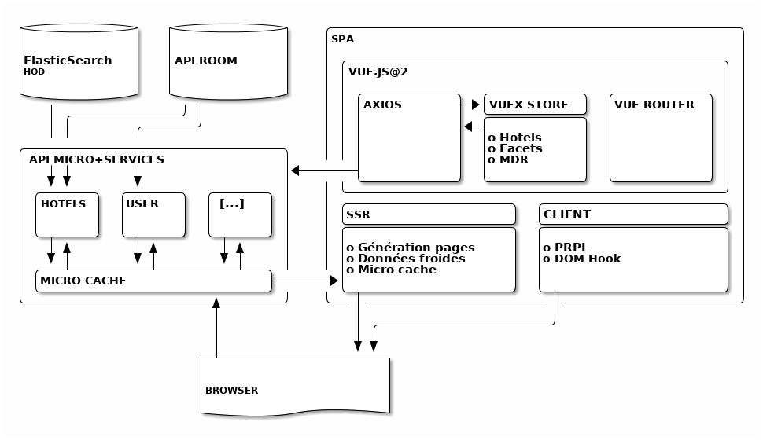

name: cover
class: middle

# Reborn   _Server Side Rendering_

Proof Of Concept - Enjeux & Démo

---
name: speaker
class: center

# m4dz

**Expertise Vue.js / SSR**

.org[
## 

.extras[
  [www.clever-age.com](https://www.clever-age.com)
]
]

---
layout: false
class: section middle
background-color: rgb(49, 48, 54)

# Reborn + Server Side Rendering

---
layout: true

.breadcrumb[Reborn + Server Side Rendering]

---
class: middle

# Reborn

.large[
* Refonte technique
* Refonte UX
* Amélioration de la transformation
]

---
class: middle

# Server Side Rendering (SSR)

.large[
* Génération de pages _à chaud + cache_ côté serveur
* Amélioration des temps de réponse
* Service de pages pré-remplies
* Code isomorphe
* Liste Hotels / Page Rates
]

---
layout: false
class: section middle
background-color: rgb(49, 48, 54)

# Pourquoi le POC ?

---
layout: true

.breadcrumb[Pourquoi le POC ?]

---
class: middle

# Technologies

.large[
* Node.js côté serveur pour le SSR
* Micro-services exposant l'API de données
* [Vue.js](http://vuejs.org/) + [Nuxt](http://nuxtjs.org/)
]

---
class: middle

# Fontaines de données

.large[
* Deux fontaines séparées
* ElasticSearch du moteur à facettes (cold-data)
* API Room (hot-data)
* Micro-cache dans les micro-services Node.js
]

---
class: middle

# Objectif : État de l'art

.large[
* Architecture / Composants
* Architecture de tests unitaires et fonctionnels
* Persistance et Offline (Service-workers)
* <abbr title="Pre-load / Render / Pre-cache / Lazy-load">PRPL</abbr> Pattern
]

---
class: middle

# État au 20 nov. 2017

.medium[
* Liste Hotels : preview
* Page Rates : à venir
* Fontaine de données : mockées, en cours sur l'<abbr title="ElasticSearch">ES</abbr>
* Socle Micro-services
* SSR opérationnel
* Architecture de tests minimale
* Ready-to-deploy
* Pas au niveau de qualité de prod, mais prêt à migrer
]

---
layout: false
class: section middle
background-color: rgb(49, 48, 54)

# Architecture technique

---
layout: true

.breadcrumb[Architecture technique]

---
class: middle

# Structure

.medium[
* Code isomorphe : codebase identique client et serveur
* Node.js pour les Micro-services + SSR
* Data API micro-services + micro-cache
* Templates micro-cache
* Agrégation des données côté serveur
* Optimisation des flux de données
* SPA client réactive sur les vues SSR
]

---
class: inverse middle

.large[

]

---
class: middle

# Implications

.medium[
* pages référençables (SEO Friendly)
* Meilleures performances
  * Rendu rapide
  * Greffe de la SPA sur le DOM servi
  * Micro-caching
* Qualité de code micro-components
* Maintenabilité (isomorphisme)
* Respect des conventions internes
]

---
class: single middle inverse

# Démo

---
layout: false
class: section middle
background-color: rgb(49, 48, 54)

# Questions ?

---
name: thanks

# Merci !

## Iconographie / Médias

- Icônes : [Linea](http://linea.io/) - [CC BY 4.0](http://creativecommons.org/licenses/by/4.0/)

## Fontes

- Titrage : [Sinzano](http://typodermicfonts.com/sinzano/) by Typodermic http://typodermicfonts.com - [Fontspring webfont EULA](https://www.fontspring.com/licenses_text/lv4e5lv2k2)
- Intertitres & labeur : [Source Sans Pro](https://github.com/adobe-fonts/source-sans-pro) by Adobe https://github.com/adobe-fonts - [Open Font Licence](https://raw.githubusercontent.com/adobe-fonts/source-sans-pro/master/LICENSE.txt)
- Monospace : [Source Code Pro](https://github.com/adobe-fonts/source-code-pro) by Adobe https://github.com/adobe-fonts - [Open Font Licence](https://raw.githubusercontent.com/adobe-fonts/source-code-pro/master/LICENSE.txt)

## Outils

- Moteur de présentation : [Remark](https://github.com/gnab/remark)

.licence[

![:ref]

disponible sous licence [CC BY-SA 4.0](http://creativecommons.org/licenses/by-sa/4.0/)
]
