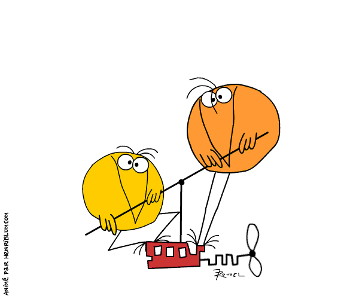
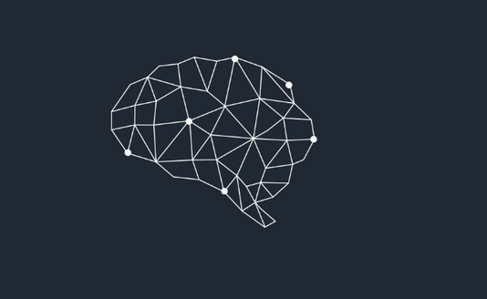

name: cover
class: middle

# Privacy by Design

De l'autonomie de l'individu sur ses données personnelles

![:ref]

---
name: speaker
class: center middle single

# m4dz

**Paranoïd Web Dino & Tech Evangelist**

.extras[
[m4dz.net](https://m4dz.net) | [@m4d_z](https://twitter.com/m4d_z) | PGP [0xD4627C417D969710](https://m4dz.net/0xD4627C417D969710.asc)
]

.org[
## 

.extras[
  [www.alwaysdata.com](https://www.alwaysdata.com)
]
]

---
layout: false
class: section bottom
background-image: url(../img/placeholders/primate-ape-thinking-mimic.jpg)

# La _privacy_, on en est où ?

---
layout: true

.breadcrumb[La _privacy_, on en est où ?]

---
class: middle center bottom-up inverse

# ~~Vous n'avez rien à craindre si vous n'avez rien à cacher~~

---
class: single middle

# La Data, ~~pétrole~~ bulle économique du 21e siècle

???

---
class: single middle

# Des grosses boîtes qui pompent les données

---
class: single middle

# Des petites boîtes qui pompent les données

.large[**et souvent, elles n'en ont même pas conscience**]

---
class: single middle

# Des startups qui pompent les données

.large[**parce qu'elles veulent faire comme les grands dans la cour de récré**]

---
class: middle center inverse

---
class: middle

# Des étudiant·e·s formé·e·s de travers aux nouvelles réglementations

.center[

]

---
class: middle center

# Le problème de la gratuité

???
Dan Ariely & Charlie et la Chocolaterie

---
class: middle

# Une histoire de données volées, mais pas vraiment finalement

.center[

]

--

.center[
Logo de Cambridge Analytica en 2016, pendant la campagne Trump
]

---
class: middle

# Vie privée, du point de vue de l'utilisateur·trice

.large[
* donner trop de pouvoir rend les choses trop complexes
* illusionner sur une protection trop parfaite
* ce n'est pas un enjeu du public
]

???

* e.g. uMatrix
* e.g Apple softs prefs
* les gens savent que leur données partent chez GAFAMs mais n'y sont pas sensibles

---
class: single middle inverse

# _Publicness_ ?

> Publicness is value. This is an argument I'll make that what's public is owned by the public — whether that's governments' actions or images taken in public space — and whenever that is diminished, it robs from us, the public.

Jeff Jarvis. 2011

→ [Jeff Jarvis - Privacy and Publicness and the power behind it - Youtube](https://www.youtube.com/watch?v=cVF5zPLPbvw)

---
layout: false
class: section bottom
background-image: url(../img/placeholders/pen-idea-bulb-paper.jpg)

# _Privacy by design_, la réponse au problème ?

---
layout: true

.breadcrumb[_Privacy by design_, la réponse au problème ?]

---
class:

# Rappel historique

* 1971 : SAFARI

???

Centralisation sur bande magnétique des identités des citoyens français

--

* 1977 : _Freedom of Information and Protection of Privacy Act_ (US)

???

Loi sur les libertés et l'informatique aux US

--

* 1978 : Loi _Informatique et Libertés_

???

Création de la CNIL

* Le droit d'information
* Le droit d'opposition
* Le droit d'accès
* Le droit de rectification

--

* 1982 : _Freedom of Information_ (Canada)

???

Loi sur les libertés et l'informatique aux Canada

--

* 1991 : décret sur les Renseignements Généraux

???

la collecte, la conservation et le traitement dans les fichiers des services des renseignements généraux d'informations nominatives relatives aux personnes majeures

--

* 1995 : **Privacy by design** (Report from Information and Privacy Commissioner of Ontario, Canada, the Dutch Data Protection Authority and the Netherlands Organisation for Applied Scientific Research)

--

* 2004 : Application de la loi aux données personnelles

???

Élargissement de la loi de 78 aux données à caractère personnel

--

* 2010 : 32e conference internationale des commissaires à la protection des données et de la vie privée, reconnaît la _Privacy by design_ comme un "élément essentiel de la protection fondamentale de la vie privée"

--

* 2018 : GDPR - _Data protection by default_

---
class: middle

# Préquelle : Accountability pattern

.large[
* début des années 80
* ensemble de procédures
* démontre la conformité aux règles de gestion
* crée les responsables de la sécurité des <abbr title="systèmes d'information">SI</abbr>
* rapporte les preuves
]

---
class: middle

# Problème : Accountability est un principe   _a posteriori_

.center[

]

---
class: single inverse middle

# Il faut un modèle de conception qui prenne en compte la vie privée

---
layout: false
class: section bottom
background-image: url(../img/placeholders/nostalgy-collector-michelle-heavy-metal.jpg)

# Conception _Privacy by design_

---
layout: true

.breadcrumb[Conception _Privacy by design_]

---
class: middle

# Les 7 lois fondamentales

.large[
(_7 laws of identity_)

1. Proactive not reactive; Preventative not remedial
1. Privacy as the default setting
1. Privacy embedded into design
1. Full functionality – positive-sum, not zero-sum
1. End-to-end security – full lifecycle protection
1. Visibility and transparency – keep it open
1. Respect for user privacy – keep it user-centric
]

???

1. anticiper, identifier, prévenir les invasions, donc prendre des actions en amont de l'attaque
2. s'assurer que toutes les données personnelles sont protégées dans IT sans action supplémentaire
3. la vie privée est core-integrated
4. approche win-win, vie privée et sécurité ne sont pas en balance
5. la donnée n'est pas conservée plus que nécessaire et sécurisée tout du long
6. tous les acteurs sont sensibilisés aux problèmes de la donnée privée
7. les données privées sont protégées par des solutions fortes par défaut, correctement indiquées et des options simples pour l'utilisateur

---
class: single inverse middle

# Et en pratique alors ?

---
class: medium

# Lors de la conception

* Concevez des check-list impliquant toutes les enjeux de données
* Assurez-vous que tous les intervenants sont sensibilisés
* Ne demandez pas plus de permissions que nécessaire
* Auditez, testez, pen testez !

--

**côté technique…**

* Chaque feature valide la check-list, en tests automatisés

--

* Les jeux de tests ne viennent pas de la prod !

--

* Oubliez les frameworks de permissions tous prêts

--

* Tests fonctionnels sur des environnements multiples

---
class: medium

# Lors de l'exécution

* Minimisez la collecte de données
* Minimisez les données échangées avec les services tiers
* Pseudonimisez la donnée
* Vérifiez les formulaires (contact, login, assistance…)
* Supprimez régulièrement la donnée collectée

--

** côté technique…**

* Utilisez des services de gestion d'identités (OpenID…)

--

* Hashez / chiffrez / tokenizez les entrées
* Permutez et substituez les données sensibles

--

* Segmentez vos jeux de données _via_ des outils statistiques (Piwik…)

--

* Faites passer des cron !

---
class: medium

# Implication de l'utilisateur·trice

* Founissez des réglages simples et notices claires
* Facilitez les souscriptions d'options via ces notices
* N'exigez pas de passer par des services externes
* Pas de partage sur les réseaux par défaut
* Séparez les consentements (_shared data_ vs _analytics_)

--

**côté technique…**

* Utilisez des outils de confidentialité différentielle sur vos DB   → [Cornell university Library](https://arxiv.org/abs/1706.09479) | [Uber SQL DIfferential Privacy](https://github.com/uber/sql-differential-privacy)

--

* Utilisez de vrais outils d'identités décentralisées (OpenID…), pas de logins _via_ les réseaux sociaux

--

* Plus de jsSocials ~~par défaut~~ par pitié…

--

* Utilisez des outils de trace d'usages respecteux (Piwik…)

---
class: medium

# Fin du cycle de vie

* Rappelez régulièrement les utilisateurs·trices à leur confidentialité
* Facilitez l'export de données
* Supprimez les données des comptes supprimés
* Supprimez les données à la fermeture du service

--

** côté technique…**

* Utilisez les frameworks de notification pour ne pas polluer (toastr, Notify.js…)

--

* Mettez en place des APIs documentées (Swagger, Apiary…) et utilisables
* Utilisez des formats de données ouverts (XML, JSON…)

--

* `rm -rf /`

---
layout: false
class: section bottom
background-image: url(../img/placeholders/bridge-wood-walk-passway.jpg)

# Sauf que ça n'est pas suffisant

---
layout: true

.breadcrumb[Sauf que ça n'est pas suffisant]

---
class: inverse bottom punchline

# Espérer est illusoire

> La _privacy by design_ est complètement aux antipodes de la souveraineté numérique des individus&nbsp;: on fait sans les individus, on protège la vie privée sans définir ce que c'est.

Fabrice Rochelandet. Souveraineté numérique et modèle d'affaires. In: Numérique, reprendre le contrôle. Framasoft: 2016, p.65

---
class: middle

# OWASP : top 10 privacy risks

.medium[
1.  Web Application Vulnerabilities
2.  Operator-sided Data Leakage
3.  Insufficient Data Breach Response
4.  Insufficient Deletion of personal data
5.  Non-transparent Policies, Terms and Conditions
6.  Collection of data not required for the primary purpose
7.  Sharing of data with third party
8.  Outdated personal data
9.  Missing or Insufficient Session Expiration
10. Insecure Data Transfer
]

---
class: middle

# Les PETs   (_Privacy Enhancing Technologies_)

.large[
* protéger la donnée personnelle
* s'assurer du consentement
* minimiser les usages
* assurer un audit des informations retenues
]

---
class: middle

# PETs existants

.large[
* anonymisation : mac / ip address spoofing, emails jetables, pseudonymat, chiffrement, Tor…
* Relais d'identification : OpenID, France Connect…
* Personnal Data Store
* EPID : Aevatar…
]

---
class: middle

# PETs à venir

.large[
* anonymous credentials
* limited disclosure technologies
* data transaction logs
* etc
]

→ initiatives comme [PrivacyTech](https://www.privacytech.fr)

---
class: middle inverse

# Tracer les parcours de la donnée

.center[

]

---
class: middle inverse

# Gérer les identités

.center[

]

---
layout: false
class: section
background-image: url(../img/placeholders/egg-hammer-threaten-violence.jpg)

# Dépasser _Privacy by Design_

---
layout: true

.breadcrumb[Dépasser _Privacy by Design_]

---
class: middle

# Agir

.large[
* penser la donnée comme un vivant périssable
* chaque acteur se doit d'alerter
* mesurer chaque brique unitairement
* assurer la portabilité
]

---
class: middle

# _Privacy by default_, alors ?

.large[
* assure qu'un minimum de données est en jeu
* simplifie le processus pour les utilisateurs·trices
* évite les difficultés dans les réglages de confidentialité
* force _idéalement_ le niveau de protection maximal _par défaut_
]

---
class: middle

# _ Privacy by using_, plutôt ?

.large[
* sensibiliser les usages
* lancer des alertes
* agir chacun à son niveau
* _Differential Privacy_
]

---
layout: false
class: section middle
background-image: url(../img/placeholders/cold-dark-eerie-fear.jpg)

# C'était pas clair ?

---
layout: true

.breadcrumb[C'était pas clair ?]

---
class: single inverse middle

# **If you can, you must**

???

- art 25
- sensibilisation

---
class: punchline bottom

> Nul ne sera l'objet d'immixtions arbitraires dans sa vie privée, sa famille, son domicile ou sa correspondance, ni d'atteintes à son honneur et à sa réputation. Toute personne a droit à la protection de la loi contre de telles immixtions ou de telles atteintes.

--

Déclaration universelle des droits de l'homme. Article 12, 1948

---
layout: false
class: section, bottom
background-image: url('../img/placeholders/collaborate.jpg')

# Questions ?

---
name: thanks

# Merci !

## Iconographie / Médias

- [Belgrado - Panopticon / Vicious Circle album](https://belgrado.bandcamp.com/track/panopticon)
- Icônes : [Linea](http://linea.io/) - [CC BY 4.0](http://creativecommons.org/licenses/by/4.0/)
- [Photo by Leah Kelley from Pexels](https://www.pexels.com/photo/close-up-of-hand-feeding-on-tree-trunk-185941/)
- [Photo by asim alnamat from Pexels](https://www.pexels.com/photo/ball-shaped-beach-blur-close-up-343720/)

## Fontes

- Titrage : [Sinzano](http://typodermicfonts.com/sinzano/) by Typodermic http://typodermicfonts.com - [Fontspring webfont EULA](https://www.fontspring.com/licenses_text/lv4e5lv2k2)
- Intertitres & labeur : [Source Sans Pro](https://github.com/adobe-fonts/source-sans-pro) by Adobe https://github.com/adobe-fonts - [Open Font Licence](https://raw.githubusercontent.com/adobe-fonts/source-sans-pro/master/LICENSE.txt)
- Monospace : [Source Code Pro](https://github.com/adobe-fonts/source-code-pro) by Adobe https://github.com/adobe-fonts - [Open Font Licence](https://raw.githubusercontent.com/adobe-fonts/source-code-pro/master/LICENSE.txt)

## Outils

- Moteur de présentation : [Remark](https://github.com/gnab/remark)

.licence[
![:ref]

disponible sous licence [CC BY-SA 4.0](http://creativecommons.org/licenses/by-sa/4.0/)
]
