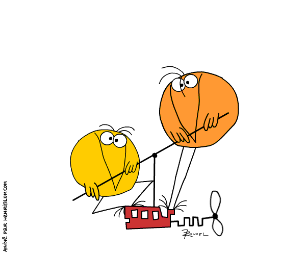

name: cover
class: middle

# Privacy by Design

De l'autonomie de l'individu sur ses données personnelles

![:ref]

---
class: inverse single right
background-image: url(helmet.jpg)

# **Réglementations, Logiciels, et Données personnelles**

---
layout: false
class: section bottom
background-image: url(../img/placeholders/primate-ape-thinking-mimic.jpg)

# La _privacy_, on en est où ?

---
layout: true

.breadcrumb[La _privacy_, on en est où ?]

---
class: single middle

# La Data, ~~pétrole~~ bulle économique du 21e siècle

???

---
class: single middle

# Des grosses boîtes qui pompent les données

---
class: single middle

# Des petites boîtes qui pompent les données

.large[**et souvent, elles n'en ont même pas conscience**]

---
class: single middle

# Des startups qui pompent les données

.large[**parce qu'elles veulent faire comme les grands dans la cour de récré**]

---
class: middle center inverse

---
class: middle

# Une histoire de données _pas vraiment_ volées

.center[

]

--

.center[
Logo de Cambridge Analytica en 2016, pendant la campagne Trump
]

---
class: middle

# Vie privée, du point de vue de l'utilisateur·trice

.large[
* donner trop de pouvoir rend les choses trop complexes
* illusionner sur une protection trop parfaite
* ce n'est pas un enjeu du public
]

???

* e.g. uMatrix
* e.g Apple softs prefs
* les gens savent que leur données partent chez GAFAMs mais n'y sont pas sensibles

---
class: punchline, bottom

> I call this device a Personal Information Telecommunication Agent, or Pita for short. The acronym also stand for Pain In The Ass, which it is equally likely to be, because having all that connectivity is going to destroy what's left of everyone's privacy.

[David Gerrold, in Sm@rt Reseller, "future of computing" prediction, 1999](./pita.jpg)

---
layout: false
class: section bottom
background-image: url(../img/placeholders/nostalgy-collector-michelle-heavy-metal.jpg)

# Conception _Privacy by design_

---
layout: true

.breadcrumb[Conception _Privacy by design_]

---
class: middle center inverse

# 1995 : Privacy by Design

???
Report from Information and Privacy Commissioner of Ontario, Canada, the Dutch Data Protection Authority and the Netherlands Organisation for Applied Scientific Research

---
class: middle

# 7 laws of identity…

.large[

1. Proactive not reactive; Preventative not remedial
1. Privacy as the default setting
1. Privacy embedded into design
1. Full functionality – positive-sum, not zero-sum
1. End-to-end security – full lifecycle protection
1. Visibility and transparency – keep it open
1. Respect for user privacy – keep it user-centric
]

???

1. anticiper, identifier, prévenir les invasions, donc prendre des actions en amont de l'attaque
2. s'assurer que toutes les données personnelles sont protégées dans IT sans action supplémentaire
3. la vie privée est core-integrated
4. approche win-win, vie privée et sécurité ne sont pas en balance
5. la donnée n'est pas conservée plus que nécessaire et sécurisée tout du long
6. tous les acteurs sont sensibilisés aux problèmes de la donnée privée
7. les données privées sont protégées par des solutions fortes par défaut, correctement indiquées et des options simples pour l'utilisateur

---
class: single inverse middle

# … en pratique :

---
class: medium

# Lors de la conception

.large[
* Concevez des check-list impliquant toutes les enjeux de données
* Assurez-vous que tous les intervenants sont sensibilisés
* Ne demandez pas plus de permissions que nécessaire
* Auditez, testez, pen testez !
]

--
.large[
**côté technique…**

* Chaque feature valide la check-list, en tests automatisés
]

--

.large[
* Les jeux de tests ne viennent pas de la prod !
]

--
.large[
* Oubliez les frameworks de permissions tous prêts
]

--
.large[
* Tests fonctionnels sur des environnements multiples
]

---
class: medium

# Lors de l'exécution

.large[
* Minimisez la collecte de données
* Minimisez les données échangées avec les services tiers
* Pseudonimisez la donnée
* Vérifiez les formulaires (contact, login, assistance…)
* Supprimez régulièrement la donnée collectée
]

--
.large[
** côté technique…**

* Utilisez des services de gestion d'identités (OpenID…)
]

--
.large[
* Hashez / chiffrez / tokenizez les entrées
* Permutez, substituez, segmentez les données sensibles (Matomo…)
]

--
.large[
* Faites passer des cron !
]

---
class: medium

# Implication de l'utilisateur·trice

.large[
* Founissez des réglages simples et des notices claires à valider
* N'exigez pas de passer par des services externes
* Pas de partage sur les réseaux par défaut
* Séparez les consentements (_shared data_ vs _analytics_)
]

--
.large[
**côté technique…**

* Utilisez des outils de confidentialité différentielle sur vos DB → [Cornell university Library](https://arxiv.org/abs/1706.09479) | [Uber SQL DIfferential Privacy](https://github.com/uber/sql-differential-privacy)
]

--
.large[
* Utilisez des outils d'identités décentralisées (OpenID…), pas les réseaux sociaux
]

--
.large[
* Plus de jsSocials ~~par défaut~~ par pitié…
]

--
.large[
* Utilisez des outils de trace d'usages respecteux
]

---
class: medium

# Fin du cycle de vie

.large[
* Rappelez régulièrement les utilisateurs·trices à leur confidentialité
* Facilitez l'export de données
* Supprimez les données des comptes supprimés
* Supprimez les données à la fermeture du service
]

--
.large[
** côté technique…**

* Utilisez les frameworks de notification pour ne pas polluer (toastr, Notify.js…)
]

--
.large[
* Mettez en place des APIs documentées (Swagger, Apiary…) et utilisables
* Utilisez des formats de données ouverts (XML, JSON…)
]

--
.large[
* `rm -rf /`
]

---
layout: false
class: section bottom
background-image: url(../img/placeholders/bridge-wood-walk-passway.jpg)

# Sauf que ça n'est pas suffisant

---
layout: true

.breadcrumb[Sauf que ça n'est pas suffisant]

---
class: inverse bottom punchline

# Espérer est illusoire

> La _privacy by design_ est complètement aux antipodes de la souveraineté numérique des individus&nbsp;: on fait sans les individus, on protège la vie privée sans définir ce que c'est.

Fabrice Rochelandet. Souveraineté numérique et modèle d'affaires. In: Numérique, reprendre le contrôle. Framasoft: 2016, p.65

---
class: middle

# OWASP : top 10 privacy risks

.large[
1.  Web Application Vulnerabilities
2.  Operator-sided Data Leakage
3.  Insufficient Data Breach Response
4.  Insufficient Deletion of personal data
5.  Non-transparent Policies, Terms and Conditions
6.  Collection of data not required for the primary purpose
7.  Sharing of data with third party
8.  Outdated personal data
9.  Missing or Insufficient Session Expiration
10. Insecure Data Transfer
]

---
class: middle

# Tracer les parcours de la donnée, pas des utilisateurs

.center[

]

---
class: middle

# Gérer les identités

.center[

]

---
layout: false
class: section
background-image: url(../img/placeholders/egg-hammer-threaten-violence.jpg)

# Dépasser _Privacy by Design_

---
layout: true

.breadcrumb[Dépasser _Privacy by Design_]

---
class: middle

# Agir

.large[
* penser la donnée comme un vivant périssable
* chaque acteur se doit d'alerter
* mesurer chaque brique unitairement
* assurer la portabilité
]

---
class: middle

# _Privacy by default_, alors ?

.large[
* assure qu'un minimum de données est en jeu
* simplifie le processus pour les utilisateurs·trices
* évite les difficultés dans les réglages de confidentialité
* force _idéalement_ le niveau de protection maximal _par défaut_
]

---
class: middle

# _ Privacy by using_, plutôt ?

.large[
* sensibiliser les usages
* lancer des alertes
* agir chacun à son niveau
* _Differential Privacy_
]

---
class: punchline bottom

> Nul ne sera l'objet d'immixtions arbitraires dans sa vie privée, sa famille, son domicile ou sa correspondance, ni d'atteintes à son honneur et à sa réputation. Toute personne a droit à la protection de la loi contre de telles immixtions ou de telles atteintes.

--

Déclaration universelle des droits de l'homme. Article 12, 1948

---
name: speaker
class: center middle single

# m4dz

**Paranoïd Web Dino & Tech Evangelist**

.extras[
[m4dz.net](https://m4dz.net) | [@m4d_z](https://twitter.com/m4d_z) | PGP [0xD4627C417D969710](https://m4dz.net/0xD4627C417D969710.asc)
]

.org[
## 

.extras[
  [www.alwaysdata.com](https://www.alwaysdata.com)
]
]

---
layout: false
class: section, bottom
background-image: url('../img/placeholders/collaborate.jpg')

# Questions ?

---
name: thanks

# Merci !

## Polices de caractère

- Titrage : [Sinzano](http://typodermicfonts.com/sinzano/) by Typodermic http://typodermicfonts.com - [Fontspring webfont EULA](https://www.fontspring.com/licenses_text/lv4e5lv2k2)
- Intertitres & labeur : [Source Sans Pro](https://github.com/adobe-fonts/source-sans-pro) by Adobe https://github.com/adobe-fonts - [Open Font Licence](https://raw.githubusercontent.com/adobe-fonts/source-sans-pro/master/LICENSE.txt)
- Monospace : [Source Code Pro](https://github.com/adobe-fonts/source-code-pro) by Adobe https://github.com/adobe-fonts - [Open Font Licence](https://raw.githubusercontent.com/adobe-fonts/source-code-pro/master/LICENSE.txt)

## Outils

- Moteur de présentation : [Remark](https://github.com/gnab/remark)

.licence.round[

![:ref]

disponible sous licence [CC BY-SA 4.0](http://creativecommons.org/licenses/by-sa/4.0/)
]
