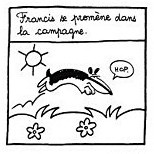
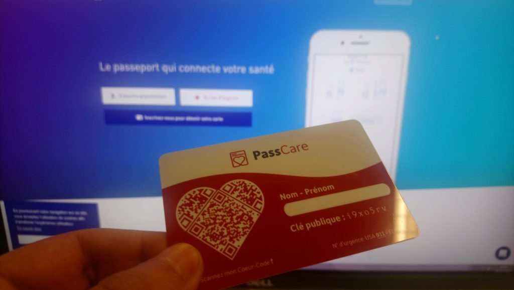

name: cover
class: middle

# Zero Knowledge Architecture

La Webapp sécurisée est-elle possible ?

![:ref]

---
background-image: url(francis.jpg)
background-size: auto 100%
background-color: #504c5a

---
class: single middle

# Comme il est dans l'air du temps, il a opté pour une numérisation de ses documents de santé.

---
class: single middle

# Mais il comme le DMP (Dossier Médical _Partagé_) n'est pas au point, il a opté pour une autre solution.

---
class: single middle

# Il utilise _PassCare_, un carnet de santé proposé par une startup qui propose de sécuriser et de rendre dispo ses infos de santé n'importe où via un simple QRCode.

---
class: single middle

# Heureusement, il sait qu'il n'est pas le produit, puisqu'il paye un abonnement pour que la société héberge ses données et les rende facilement disponibles.

---
class: single middle center

## Francis est rassuré, il va chez son médecin.

---
class: middle center

# What could possibly go…

---
class: single middle

# Malheureusement, les données des habitudes de vies embarquées dans son profil incitent le médecin à penser à un problème cardiaque, il surcharge Francis d'examens et de surmédication.

---
class: single middle

# En plus, sa mutuelle, qui lui a proposé de prendre en charge son coût d'abonnement, a désormais accès à ses données, et refuse de prendre en charge les dépassements d'honoraires.

---
class: single middle

# Son employeur, qui avait souscrit le Pass dans le cadre de sa politique d'entreprise, craint que Francis ne devienne alcoolique. Elle le licencie préventivement.

---
class: single middle center

## Finalement, Francis avait juste un gros rhume.

---
class: inverse middle center

# Guess what?

.large[

]

---
layout: false
class: section top
background-image: url(../img/placeholders/two-brown-sea-turtle-on-tree-branch.jpg)

# Partager : quoi, comment, et avec qui ?

---
layout: true

.breadcrumb[Partager : quoi, comment, et avec qui ?]

---
class: center middle

# La donnée est sensible

---
class: single middle

# Cloud everywhere

---
class: single middle

# Qui stocke quelles informations ?

---
class: single middle

# L'information transite (beaucoup)

---
class: single middle

# On ne devrait pas avoir (à penser) à se protéger

---
class: single middle inverse

# Mais on n'a pas le choix

---
class: middle tiles

# Reprendre le contrôle

- <svg><use xlink:href="../img/icons/fontawesome/fa-solid.svg#user-secret"/></svg> qui peut accéder aux données
- <svg><use xlink:href="../img/icons/fontawesome/fa-solid.svg#file-invoice"/></svg> quelles informations sont partagées
- <svg><use xlink:href="../img/icons/fontawesome/fa-solid.svg#heartbeat"/></svg> quelles sont leurs durées de vie
]

---
class: middle single inverse

.large[
> **ZKA** est un design d'application qui permet de fournir des accès à la donnée personnelle pour les applications clientes en garantissant que ces services n'auront jamais accès à des contenus en clair, sans permission.
]

---
class: middle

# Concepts

.large[
- Authentication zero-proof
]

--

.large[
- End-to-end encryption
]

--

.large[
- Encrypted Data Only
]

--

.large[
- No-naive approach
]

---
class: middle center

# Comment ça fonctionne ?

---
class:

# Zero-knowledge

--

1. <svg><use xlink:href="../img/icons/fontawesome/fa-solid.svg#unlock"/></svg> création d'un mot de passe

--

2. <svg><use xlink:href="../img/icons/fontawesome/fa-solid.svg#certificate"/></svg> création d'une clef intermédiaire, chiffrée par ce mot de passe, basé sur le CER racine de l'app sur le serveur

--

3. <svg><use xlink:href="../img/icons/fontawesome/fa-solid.svg#key "/></svg> création de deux paires de clefs RSA : une pour l'auth (signature), l'autre pour la data (chiffrement), chiffrées avec la clef intermédiaire

--

4. <svg><use xlink:href="../img/icons/fontawesome/fa-solid.svg#file-upload "/></svg> les clefs publiques sont envoyées sur le serveur + hash des clefs privées uniquement

--

5. <svg><use xlink:href="../img/icons/fontawesome/fa-solid.svg#piggy-bank"/></svg> les clefs privées sont stockées côté client, déchiffrées avec la clef intermédiaire, elle-même déchiffrée avec le mdp utilisateur

---
class: middle center inverse single

# **Auth (ZKP)**

---
class: middle center

# La caverne d'Ali Baba

.small[

]

(Ceci est une caverne)

---
class: middle center

# La caverne d'Ali Baba

.small[

]

(Ceci est toujours une caverne, _Rouge_ y est coincée)

---
class: middle center

# La caverne d'Ali Baba

.small[

]

(Ceci est encore la même caverne, mais _Rouge_ connaissait le mot de passe)

---
class: middle

# Clefs

.large[
- un certificat intermédiaire par service
- deux paires de clefs par service
- la paire de signature sert à l'authentification
]

---
class: middle

# Preuve à connaissance nulle

.large[
- le service qui souhaite s'authentifier se présente au serveur
- le serveur teste sa clef privée de signature via un handshake
- le serveur garantit au client la bonne auth du service
]

---
class: middle

# Sécurité

.large[
- il n'y a pas d'échange de mot de passe
- les clefs sont révocables via les CER intermédiaires en cas de compromission
]

---
class: middle center inverse single

# **E2EE**

---
class: middle

# Chiffrement

.large[
- dans le client uniquement
- en utilisant la clef publique du service qui demande l'accès
- en faisant du _key wrapping_ de clef synchrone (IDEA, par exemple)
]

---
class: middle

# Déchiffrement

.large[
- dans le service
- en utilisant la clef privée pour récupérer la clef synchrone
]

---
class: middle

# Sécurité

.large[
- chaque clef synchrone est à usage unique data / service
- la clef synchrone porte l'expiration (datetime token)
]

---
class: middle center inverse single

# **Approche non-naïve**

---
class: middle center

# Document tree Data Blob

---
class: middle

# Sécurité

.large[
- pas de partage global des documents
- chaque blob est chiffré isolément, par service, avec une clef unique
- la granularité est la plus fine possible
- le stockage se fait dans le cloud, chiffré, sans connaissance des clefs
- les accès aux ressources interdites sont impossibles
]

---
layout: false
class: section bottom
background-image: url(../img/placeholders/food-healthy-dry-pattern.jpg)

# Comment c'est possible ?

---
layout: true

.breadcrumb[Comment c'est possible ?]

---
class: middle center single inverse

# **État de l'art**

---
class: middle center

# C'est compliqué

---
class: middle single

# ZKA s'appuie sur la _confiance_ dans l'app cliente

---
class: middle

# Implémentations

.large[
- SignalProtocolKit::SessionBuilder
- CossackLabs (PoC)
]

---
class: middle

# Mobile / Desktop

.large[
- code compilé
- stockage de clefs sécurisé
- environnement contrôlé
- intrusions prévenues
]

---
class: middle inverse single

# Coté Web ?

## Sécuriser la couche crypto du navigateur

---
class: middle

# CORS

.large[
- protège des requêtes vers des domaines non-reconnus
- prévient des injections depuis des ressources extérieures
- interdit l'écriture sauvage dans le document
]

---
class: middle

# CSP

.large[
- autorise explicitement les ressources (JS, assets, etc)
- prévient l'injection XSS / data
- protège l'intégrité de l'app
]

---
class: middle

# SRI

.large[
- vérifie la signature des assets
- protège du MITM
- garantit l'intégrité des ressources exécutées
]

---
class: middle

# Referrer-Policy

.large[
- évite la fuite des URI privées
- isole les URLs de l'app
- protège du tracking malicieux
]

---
class: middle

# Key-storage

.large[
- basé sur WebCrypto
- avec File-API
- en proposant une mécanique d'export des clefs chiffrées / CER intermédiaires
]

---
class: middle single

# WebAssembly

.large[
Prévient la lecture du code exécuté et rend l'extraction de données complexe
]

---
layout: false
class: section top
background-image: url(../img/placeholders/egg-hammer-threaten-violence.jpg)

# ZKA (pour le Web, mais pas seulement)

---
layout: true

.breadcrumb[ZKA (pour le Web, mais pas seulement)]

---
class: middle

# Minimiser les risques

.large[
- fuite de données → Chiffrement
- escalades de privilèges → Chiffrement
- usurpation d'ID → ZKP (Chiffrement)
- limitation de la zone d'attaque
]

---
class: middle

# Dans quels contextes ?

.large[
- logs
- complex docs
- filesystems
- remote storage
]

---
class: middle center inverse

---
class:

# À qui choisissons-nous de faire confiance ?

.large[
- Aux constructeurs ?
]

--

.large[
- Aux implémenteurs ?
]

--

.large[
- Aux éditeurs ?
]

--

.large[
- Aux utilisateurs ?
]

.center[

]

---
class: middle inverse single

# **Nous avons besoin d'auditabilité**

.large[
Open source, audits publics, structures publiques, rapports autonomes…
]

---
class: middle

# ZKA

.large[
- complexe et coûteux
- le Web en est capable
- ce n'est qu'un moyen
- trou de confiance
]

.center[

]

---
name: speaker
class: center middle single

# m4dz

**Paranoïd Web Dino & Tech Evangelist**

.extras[
[m4dz.net](https://m4dz.net) | [@m4d_z](https://twitter.com/m4d_z) | PGP [0xD4627C417D969710](https://m4dz.net/0xD4627C417D969710.asc)
]

.org[
## 

.extras[
  [www.alwaysdata.com](https://www.alwaysdata.com)
]
]

---
layout: false
class: section, bottom
background-image: url('../img/placeholders/collaborate.jpg')

# Questions ?

---
name: thanks

# Merci !

Un immense merci à _Claire & Jake_ pour la formidable série des Francis, qui m'ont beaucoup inspiré cette introduction.

## Icônes

- [FontAwesome](https://fontawesome.com/)

## Polices de caractère

- Titrage : [Sinzano](http://typodermicfonts.com/sinzano/) by Typodermic http://typodermicfonts.com - [Fontspring webfont EULA](https://www.fontspring.com/licenses_text/lv4e5lv2k2)
- Intertitres & labeur : [Source Sans Pro](https://github.com/adobe-fonts/source-sans-pro) by Adobe https://github.com/adobe-fonts - [Open Font Licence](https://raw.githubusercontent.com/adobe-fonts/source-sans-pro/master/LICENSE.txt)
- Monospace : [Source Code Pro](https://github.com/adobe-fonts/source-code-pro) by Adobe https://github.com/adobe-fonts - [Open Font Licence](https://raw.githubusercontent.com/adobe-fonts/source-code-pro/master/LICENSE.txt)

## Outils

- Moteur de présentation : [Remark](https://github.com/gnab/remark)

.licence.round[

![:ref]

disponible sous licence [CC BY-SA 4.0](http://creativecommons.org/licenses/by-sa/4.0/)
]
